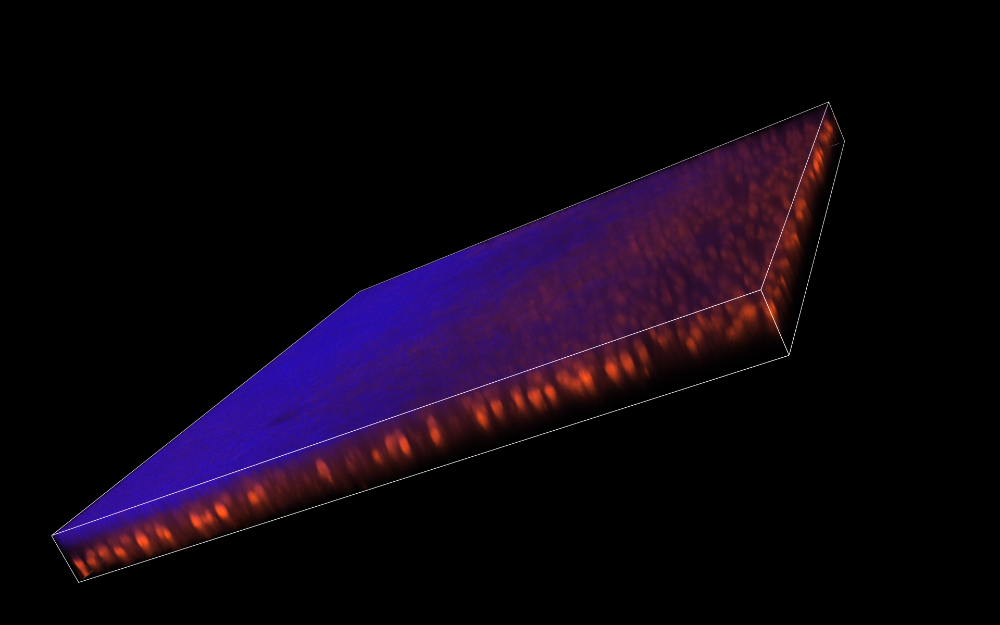
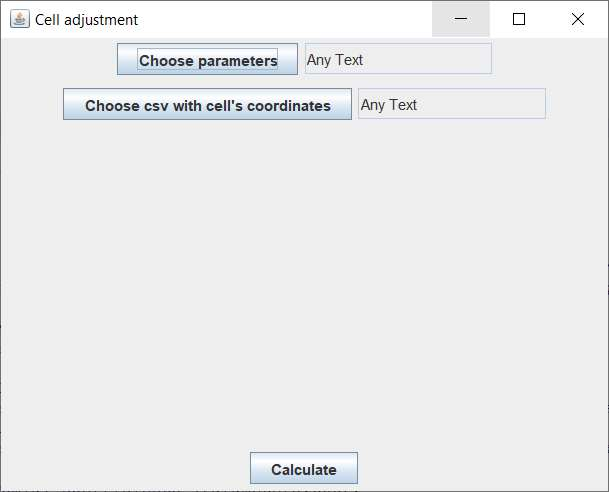
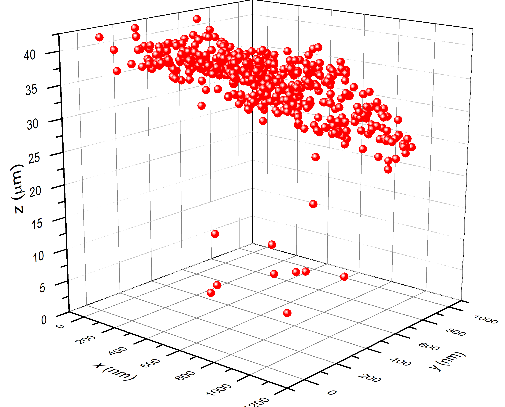
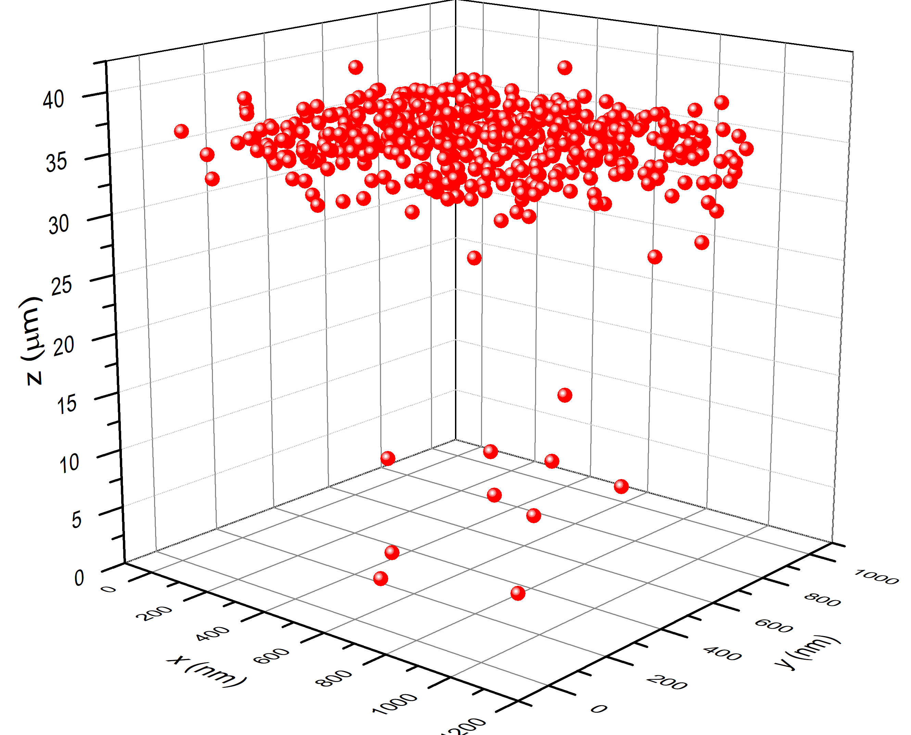

# Cell Adjustment

## Purpose
Owing to the nature of tissue samples a shift of layers is present in the vast majority of these specimen.
  
This FIJI plugin correct Z-ccoordinates of identified cells based on the correction coefficient matrix created by [Retina Iron](https://github.com/janositibor/RetinaIron).  

## Install
* Clone the Maven project in this repository to your local drive.
* Build your .jar files

## Use
* Run the .jar files with Java Virtual Machine
* Provide the requred data for the calculation
    * Browse the file with the correction coefficient matrix by clicking on the button "Choose parameter" (An example (Parameters.txt) is in the "Documentation" folder)  
	* Browse the csv with the identified cells by clicking on the button "Choose csv with cell's coordinates" (ExampleCells.csv is in the "Documentation" folder)
	* When both of them are selected ,press the "Calculate" button at the top of the window.

* The result will be saved in the folder of the input file with the cell coordinates. It can be distinguished by the concatenated string "_corrected" in the file's name.
* Owing to this correction the cells Z-locations have limited extent.
    * Original position of identified cells on a curvy tissue layer:
    
    * Original position of identified cells on a curvy tissue layer:
    